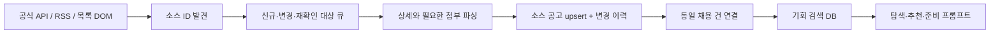

# CREAI_IT-HR — 채용 공고 수집·갱신·중복 통합 기획

> 2026-09-26 구현: 세 소스 어댑터·수동 discover/refresh·SQLite 저장·변경 이력·분석 대기 등록을 추가했다. 스케줄러, LLM 실행, 플랫폼 간 의미 기반 통합은 미구현이다. 현재 범위와 검증은 [README](../README.md) 및 [검증 기록](ingestion-verification-2026-09-26.md)을 따른다.
기준일: 2026-09-26 · 상태: 1차 3개 소스 범위 확정, 연구 기반 설계, 구현 전

[제품 정의](product-definition.md)와 [1차 3개 사이트 DOM 심층 조사](research/phase-1-dom-deep-dive-2026-09-26.md)를 바탕으로 한다. [기존 10개 사이트 실사](research/job-sources-2026-09-25.md)는 후보 조사 기록으로 보존한다.

## 1. 달성할 결과

사용자는 여러 사이트의 채용·인턴 기회를 한 번씩 보고, 실제 지원 가능한지 확인하고, 공고의 근거를 외부 AI 준비 프롬프트로 가져갈 수 있어야 한다. 운영진은 낮은 비용으로 새로운 공고뿐 아니라 **수정·마감·재공고**까지 계속 반영할 수 있어야 한다.

선택하는 구조는 **소스별 어댑터 + 하나의 수집 DB + 공통 갱신·중복 처리**다. 사이트마다 별도 제품을 만들거나, 사용자 검색 때마다 인터넷을 실시간으로 훑지 않는다. 아래 내용은 구현할 계약이며 현재 자동 수집이 돌아간다는 뜻이 아니다.

## 2. 수집 대상과 범위를 정하는 기준

**1차 소스는 사람인·잡코리아·인크루트로 확정한다.** 세 곳에서 신규 발견→상세 확보→저장된 내용과 비교→수정·마감 반영이 반복 실행되는 인프라를 먼저 완성한다. 링커리어·원티드·점핏·랠릿·JOB-ALIO·고용24·Greeting은 후보 조사만 보존하고 이번 구현 대상에서 제외한다.

초기 사용자 범위에 맞춰 신입·인턴·주니어뿐 아니라 **경력무관, 신입 지원이 함께 가능한 공고**를 포함한다. AI·개발 직무로 제한하지 않는다. 반대로 경력이 많은 사람만 지원 가능한 공고를 양을 늘리려고 계속 상세 수집할 필요는 없다. 목록 메타데이터로 명확하게 제외할 수 있을 때만 일찍 제외하며, 모호하면 상세에서 판단한다.

각 소스에 `coverage_scope`를 기록한다. 예를 들어 ‘잡코리아 신입공채 API 승인 범위’와 ‘잡코리아 전체 채용’은 다른 주장이다. 특정 목록이나 RSS 일부를 읽어 놓고 사이트 전체를 수집했다고 표시하지 않는다.

## 3. 최소 구조

Next.js는 저장된 공고를 조회한다. 수집 실행은 사용자 요청과 분리한 정기 작업으로 한다. 처음에는 **DB 작업 테이블과 단일 worker**면 충분하다. 긴 브라우저 순회는 웹 요청 안에서 실행하지 않는다. 잡코리아의 승인 IP 조건이 적용된다면 worker의 송신 IP를 고정한다. 외부 queue·다수 마이크로서비스를 먼저 도입할 이유는 없다.

### 데이터 책임

| 레코드 | 반드시 보존할 것 | 존재하는 이유 |
| --- | --- | --- |
| `source_config` | 소스·tenant, 시작점, 수집 방식, 적용 범위, 승인/재사용 범위, 요청 예산, 파서 버전 | 사이트별 차이와 운영 범위를 명시 |
| `source_posting` | 소스 공고 ID, 원문·지원 URL, 원본 근거, 정규화 필드, 확인/변경/상태 시각, hash, 연결된 opportunity ID | 원문별 사실을 잃지 않고 반복 갱신 |
| `opportunity` | 사용자에게 보여줄 채용 건, 대표 출처, 필드별 선택 근거, 관계 유형 | 여러 출처를 하나의 기회로 탐색 |
| `ingest_run` | 실행 범위·경계 시각·페이지 진행·완료 여부·오류·건수 | 실패한 수집을 성공으로 오인하지 않음 |
| `posting_revision` | 실제로 바뀐 필드와 이전/이후 값, 관측 시각, 근거 | 기간 연장·조건 변경을 추적 |

작업 중복 방지와 source posting의 유일 키는 `(source, tenant_key, source_id)`다. tenant가 없는 소스도 null 동작 차이로 중복이 생기지 않도록 고정 빈값 등 하나의 표현으로 통일한다. 실행 재시도나 동시에 들어온 작업에도 DB unique constraint로 보호한다.

공고당 필요한 필드는 제목, 게시자, 실제 고용주, 직무·업무, 필수·우대 요건, 경력, 학력, 고용형태, 근무지, 급여, 기간 유형, 마감일, 원문·지원 URL이다. 모르는 값은 null과 원문 상태로 남긴다. 한 공고가 여러 직무·지역을 모집하면 배열 또는 캠페인으로 표현하며 임의로 한 직무만 고르지 않는다.

### 시각과 상태를 섞지 않기

- `source_published_at`, `source_updated_at`: 소스가 제공한 시각. 미제공이면 null.
- `first_seen_at`, `last_seen_in_list_at`: 우리 수집기가 발견한 시각.
- `last_detail_verified_at`: 상세/공식 상태를 성공적으로 확인한 시각.
- `source_status`: 원문이 명시한 채용중·마감 등의 값.
- `availability`: scheduled / open / deadline_elapsed / closed / unknown.
- `fetch_state`: ok / inaccessible / parse_failed / removed_candidate.

접근 실패는 공고 마감이 아니다. 목록에서 보였다는 사실도 상세 요건까지 방금 검증했다는 뜻은 아니다. 접수 시작 전 공고는 scheduled로 구분하고, 기간만 지난 경우와 원문이 명시적으로 마감한 경우도 구분한다.

마감은 원문 문자열, 날짜/시각의 정밀도, timezone을 함께 저장한다. 날짜만 제공된 공고에 임의의 정확한 마감 시각을 표시하지 않는다. 국내 시각으로 명시된 값은 Asia/Seoul 기준으로 변환하고, `Z`가 있는 ISO 시각은 UTC로 해석한다. 날짜 없는 D-day만으로 영구 마감일을 확정하지 않는다.

## 4. 사이트별 구현 계약

어댑터는 `discover(scope, checkpoint)`, `read(postingRef)`, `normalize()`의 책임을 가진다. 실제 API나 DOM이 제공하지 않는 기능을 공통 인터페이스 때문에 만들어내지 않는다.

| 소스 | source ID | discovery / 변경 발견 | 본문·상태 갱신 |
| --- | --- | --- | --- |
| 사람인 | `rec_idx` / API job ID | 승인 API 수정 구간 + 페이지 우선; DOM 수정순은 재탐색 신호 | 현재 ID의 `.wrap_jv_cont`로 한정한 조건·접수 섹션·iframe |
| 잡코리아 | `GI_Read` / `data-gno` 숫자 문자열 | 승인 신입공채 API 우선; DOM 정렬·페이지 이동 별도 처리 | JobPosting + 늦게 로드되는 현재 Gno iframe + 접수 섹션 |
| 인크루트 | `job` 문자열 | 오늘 + 상시 대상 목록, RSS 후보 합집합 | EUC-KR HTML + 해당 job iframe; 일반/외부 연동 마감 템플릿 구분 |

HTTP로 필요한 정보가 내려오면 일반 파서가 우선이다. 브라우저는 그 정보가 실제로 렌더링에 의존할 때만 쓴다. DOM에 없는 내부 API 주소·cursor·토큰을 추정해 계획의 확정 사항으로 넣지 않는다.

실제 DOM 선택자, 필터 값, HTTP와 렌더링의 차이, 표본별 오류 방지는 [심층 조사](research/phase-1-dom-deep-dive-2026-09-26.md)에 명시했다. 사람인 일반 HTTP는 307이었고, 잡코리아 본문 iframe은 최초 응답 후에 나타났다. 동일한 HTTP 파서 하나로 세 소스를 끝낸다는 가정을 하지 않는다.

## 5. ‘겹치지 않게’는 두 단계로 해결한다

### 5.1 같은 사이트에서 다시 발견된 공고

소스 ID가 같으면 항상 upsert한다. 목록 1·2페이지에 중복 노출되거나 필터가 겹쳐도 한 행이다. URL의 slug, 광고 query, 제목이 바뀌어도 새 공고를 만들지 않는다.

URL 정규화는 소스별로 한다. ID query는 보존하고, 확인된 추적 인자만 내부 비교 키에서 제외한다. 원문 이동 링크는 별도로 보존해 제휴상 필요한 출처·추적 인자를 무조건 지우지 않는다. 지원 링크의 서명·필수 query도 제거하지 않는다.

### 5.2 여러 사이트에 실린 동일 모집

모든 원본 source posting은 남겨 둔다. **중복을 없애기 위해 원본을 버리는 것이 아니라, 같은 opportunity에 연결한다.** 잘못 합쳤을 때 연결을 되돌릴 수 있어야 한다.

| 근거 | 처리 |
| --- | --- |
| 같은 공식 기업·같은 개별 모집 ID/지원 URL, 모집 단위도 일치 | 자동 연결 가능한 강한 근거 |
| 같은 기업, 같은 역할·고용형태·지역·모집 기간, 본문 내용까지 일치 | 중복 후보; 처음에는 보수적으로 검토 후 규칙 승격 |
| 제목·기업명만 비슷함 | 자동 병합 금지 |
| 같은 그룹 채용 캠페인 안의 계열사·개별 직무 | 동일 건 병합 대신 캠페인 관계 |
| 이전과 비슷하나 새 ID·새 기간의 재공고 | 새 공고 보존, 이전 모집과 관계 표시 |
| 헤드헌터 공고에서 실제 회사가 비공개 | 게시자명으로 다른 채용 건과 합치지 않음 |

기업명은 ‘주식회사’, 표기 흔들림을 정규화하되 별칭 등록에는 근거가 있어야 한다. 사업자번호·소스 기업 ID·공식 도메인은 기업 식별에 쓰고 **공고 식별에 쓰지 않는다**. 동일 그룹의 다른 법인도 구분한다.

후보 검색은 정규화 기업 + 직무 + 지역/형태 + 기간으로 좁히고, 본문 유사도는 추가 신호로 쓴다. 처음부터 모든 공고를 LLM으로 서로 비교하지 않는다. 확신이 없으면 원본을 별도 기회로 남기는 편이 서로 다른 직무를 없애는 것보다 낫다.

**1차 소스 실사에서 발견한 함정**

- 잡코리아 한 행의 `data-gno`와 `data-gino`가 달랐다. 현재 상세 URL에 대응하는 gno를 사용한다.
- 사람인 CJ 공고의 지원 링크는 그룹 채용 홈페이지였다. 이를 기준으로 합치면 CJ의 다른 모집도 사라진다.
- 인크루트 헤드헌터의 회사 정보는 실제 고용주와 다를 수 있다. 게시자 회사명만으로 묶지 않는다.

## 6. 신규·변경·마감을 놓치지 않는 갱신

### 수정일 증분 조회가 있는 소스

사람인 API처럼 수정 구간이 문서화된 경우 다음 방식으로 수집한다.

1. 실행 시작 시 상한 `T`를 고정한다.
2. 마지막 성공 경계보다 앞선 overlap부터 `T`까지 전 페이지를 읽는다.
3. 동일 시각의 여러 공고도 ID로 모두 upsert한다. 페이지/시간 구간 제한에 걸리면 더 작은 구간으로 나눈다.
4. 모든 페이지의 저장이 끝나야 성공 경계를 `T`로 전진시킨다.
5. 중간 실패 시 성공 경계를 그대로 두고 재시도한다. 중복 작업은 DB 키가 흡수한다.

overlap의 초기 제안은 48시간이다. 실제 지연·수정량·quota를 관찰해 조정할 값이지 검증된 최적값은 아니다.

### 등록순 목록·RSS만 있는 소스

새 글 발견과 기존 글 수정 감지를 분리한다.

- 최신 목록은 최근 페이지들을 중첩해서 읽는다. 고정 광고·추천, 오래된 공고의 재노출을 구분한다.
- 신규 ID와 목록 필드가 변한 ID를 상세 큐에 넣는다.
- 이미 알고 있는 활성 공고도 별도 일정으로 상세를 읽는다. 본문만 수정된 공고는 최신 목록만으로 찾을 수 없기 때문이다.
- RSS는 최근 일부만 제공할 수 있으므로 기간별 목록 대조를 함께 한다. 긴 수집 공백 이후 RSS만 읽고 복구 완료로 처리하지 않는다.
- ‘이미 본 ID 등장’이나 ‘두 번 스크롤했는데 없음’을 전체 수집 완료로 단정하지 않는다. 종료 근거가 부족하면 partial이다.

사람인 DOM의 수정순에서도 행에는 등록 시각이 표시됐고, 잡코리아 최신업데이트순에는 점프업 공고가 섞였다. 이 순서를 정확한 수정 cursor로 취급하지 않는다. 인크루트의 오늘 목록은 날짜가 바뀌면 범위도 바뀌므로 상시 목록 대조가 필요하다.

목록 조건의 `discovery_signature`, 상세 내용의 `detail_content_hash`, 상태·기간의 `availability_signature`를 분리한다. 상대 시각·D-day·노출 순위는 내용 변경에서 제외한다. 상세 일부 파싱에 실패하면 이전 유효 필드를 유지하고 실패 영역을 기록한다. 과거 실행의 늦은 응답이 최신 관측값을 덮어쓰지 않도록 시각을 비교한다.

### 마감·누락·재오픈

- 원문/API가 명시한 종료 상태는 반영한다. 마감일이 지난 경우는 `deadline_elapsed`로 현재 추천에서 제외하고 재검증해 연장을 반영한다.
- 채용시·상시·날짜 미상은 서로 구분하며 자동 종료일을 부여하지 않는다.
- HTTP 403/429/5xx, timeout, 깨진 selector, 파싱 결과 0건은 **실행 실패 또는 미확인 상태**다. 채용 마감으로 바꾸지 않는다.
- 완주한 활성 목록에서 빠져도 상세를 확인한다. 권위 있는 API 계약이 ‘목록에서 사라짐=삭제’를 보장할 때만 그 의미를 적용한다.
- 같은 ID가 다시 채용중이 되면 재오픈 이력을 남긴다. 새 ID이면 새 source posting이다.
- 병합된 기회의 출처끼리 마감이 다르면 공식 개별 모집의 최신 확인 결과를 우선한다. 출처 간 충돌을 숨기지 않으며, 플랫폼 하나의 마감만으로 모든 지원 경로를 닫지 않는다.

## 7. 저비용 실행 주기와 작업 예산

다음은 시작 설정 제안이다. 각 소스의 승인 quota·권장 간격·공고 수가 우선한다.

| 작업 | 초기 주기 | 목적 |
| --- | --- | --- |
| 신규·수정 후보 발견 | 4~6시간 | 새 기회·변경 신호 확보 |
| 일반 활성 공고 재검증 | 24~48시간 | 오래된 공고의 수정·조기마감 확인 |
| 24시간 이내 마감 예정 | 최대 6시간 간격, 예산 우선 배정 | 마감 직전 잘못된 안내 최소화 |
| 전체 활성 범위 대조 | 주 1회, 분할 실행 | 수집 공백·정렬 이동의 누락 복구 |
| 마감 직후 연장 여부 | 1회 후 필요 시 추가 | 기간 연장·재오픈 발견 |

정기 수집은 이번 작업에서 활성화하지 않았다. 인프라 구현 시 작업 실행 환경의 scheduler로 등록한다.

소스별 동시성은 처음에 1, DOM 요청 간격은 최소 2초를 기본 제안으로 두되 더 엄격한 규칙이 있으면 따른다. 429의 Retry-After를 존중하고 실패가 반복되면 해당 소스만 멈춘다. 무제한 재시도·프록시 회전·차단 우회는 비용 절감 방법으로 사용하지 않는다.

일 요청량은 다음처럼 계산한다.

`목록 페이지 수 × 하루 탐색 횟수 + 신규/변경 상세 수 + 활성 재검증 수 + 제한된 재시도`

예를 들어 한 소스에 활성 10,000건이 있고 개별 상세만 가능하면, 48시간 재검증에도 하루 약 5,000번의 상세 요청이 든다. 이 가상의 경우 일 500회 quota로는 충족하지 못한다. 목록 API의 상태·수정 신호를 활용하거나, 수집 범위/검증 주기를 줄여야 한다. **3개 사이트로 한정해도 요청량·브라우저 실행 시간을 측정해야 비용을 판단할 수 있다.**

우선순위는 마감 임박 상태 확인 → 신규·수정 후보 → 오래된 활성 공고 → 과거 backfill이다. 예산 초과는 건너뛴 범위·다음 재시도 시각과 함께 남긴다. 매 실행 전체 공고에 OCR·LLM을 다시 호출하지 않는다.

## 8. 본문 품질과 출처 신뢰

구조화 데이터도 오류가 있다. 인크루트 표본의 headhunter 소재지와 실제 근무지가 달랐다. 잡코리아 JobPosting의 description도 실제 본문 전체를 포함하지 않았다.

- 필드마다 원문 값·출처·추출 방식·확인 시각을 남긴다. 정규화된 값이 원문을 없애면 안 된다.
- 공고 본문은 현재 공고의 영역/iframe만 읽는다. 추천·광고·댓글·로그인 UI·PC/모바일 중복을 제외한다.
- 본문 hash에는 업무·조건·기간·지원 경로처럼 의미 있는 필드만 넣는다. 조회수·D-day·광고·DOM 스타일 변경은 제외한다.
- `content_quality`는 structured_text / image_or_attachment / metadata_only / incomplete 정도로 구분한다. 텍스트 길이만으로 충분성을 판정하지 않는다.
- 이미지와 공고 첨부는 권한이 허용된 범위에서만 추출한다. 이미지/PDF/HWP별 extractor를 적용하고 내용 hash가 바뀐 경우만 다시 처리한다. 같은 이미지 URL이라도 내용이 바뀔 수 있으므로 URL만 캐시 키로 삼지 않는다.
- OCR에서 읽히지 않는 지원 자격·날짜를 추측하지 않는다. 원문 확인이 필요하다고 표시한다. 첨부는 공고문/직무기술서와 지원서 양식을 구분한다.
- 저장·표시하는 HTML은 정제한다. 공고문에 있는 지시문은 추천 에이전트의 실행 명령이 아닌 외부 자료다.

### 준비 프롬프트 기능과 연결

추천과 준비 프롬프트에는 실제 확보한 업무·요건만 넣고, 원문 URL·최근 확인일·누락된 항목을 함께 전달한다. 전문 재사용이 허용되지 않거나 본문을 읽지 못한 소스는 링크와 허용된 메타데이터로 제한하고, 세부 공고문 입력이 필요하다고 안내한다. 메타데이터만 수집한 상태에서 완전한 지원 준비 맥락을 확보했다고 말하지 않는다.

## 9. 구현 전 확정할 외부 의존성

기술 난이도보다 **제공 범위·quota·재사용 조건**이 수집 전략을 바꿀 수 있다.

| 소스 | 확정할 사항 | 확정 전 상태 |
| --- | --- | --- |
| 사람인 | API 접근·quota 단위·상세 본문 접근과 재사용 | 공개 규격 확인, 연동 승인 미확보; 일반 HTTP 307 |
| 잡코리아 | 신입공채 API 범위·송신 IP·ID 대응·전문 재사용 | 공개 안내 확인, 승인 API 및 목록 AJAX 계약 미검증 |
| 인크루트 | 자동 수집·원문 제공 범위, 적용되는 robots와 요청 제한 | 목록·본문 HTTP 확인; 운영 이용 조건 확정 전 |

HR은 무료지만 교육 서비스로 연결하는 제품이라는 사용 목적을 연동 조건 검토에 반영한다. 사용자에게 무료라는 사실만으로 데이터 이용 조건을 충족했다고 가정하지 않는다. 운영 비용이 맞지 않는 유료 제휴는 승인 없이 체결하지 않고 해당 소스 범위를 줄이는 방향으로 판단한다.

## 10. 실제 구현 순서와 완료 판정

### 순서

1. **공통 ID·저장·실행 이력부터:** 같은 입력을 재실행해도 새 공고가 생기지 않는 upsert와 실패 상태를 만든다.
2. **인크루트로 전체 흐름 검증:** 이용 조건 확정 후 일반 HTTP 목록→현재 공고 본문→delta→갱신을 연결한다. 오늘 목록과 기존 활성 공고 재확인을 함께 검증한다.
3. **사람인·잡코리아 연결:** 승인 API를 우선 적용하고, 필요한 본문 보완만 소스별 DOM 계약으로 처리한다. 승인 대기 소스는 대기 상태로 남기며 임의로 다른 사이트를 추가하지 않는다.
4. **세 소스 반복 실행 검증:** 기간 연장·조기마감·누락·부분 실패·재오픈과 서로 다른 모집의 잘못된 병합을 확인한다. 다른 7개 사이트 구현은 1차 범위에 포함하지 않는다.

### 소스별 완료 체크

- 목록의 다음 페이지/추가 로딩과 종료 조건을 확인하고 수집 범위를 명시했다.
- 같은 공고를 두 번 수집해도 source posting과 opportunity가 불필요하게 늘지 않는다.
- 제목/slug 변경, 마감 연장, 조건 수정이 새 공고 대신 revision으로 남는다.
- 파싱 실패·목록 0건·일부 페이지 실패가 대량 마감 처리로 이어지지 않는다.
- 본문에 다른 공고·추천·댓글·로그인 요소가 섞이지 않는다.
- 캠페인/개별 직무, 비공개 고용주, 상시채용, 새 ID 재공고, 동일 공식 지원 ID 사례를 검증했다.
- 대표 표본의 회사·역할·기간·지원 링크를 원문과 대조했다. 서로 다른 모집을 합치는 오류가 나오면 자동 병합 규칙을 좁힌다.

### 관측할 최소 지표

소스별 성공/실패, 발견·신규·변경·마감 건수, 마지막 성공 실행, 확인 시각의 노후도, incomplete 비율, 전체/부분 수집 여부, 요청·브라우저 시간·추출 비용을 기록한다. 중복률은 소스 수가 늘면 자연히 올라갈 수 있으므로 단독 성공 지표로 삼지 않는다. 잘못 합친 공고와 놓친 변경을 표본 대조해야 한다.

이 기획의 완료는 **1차 세 소스의 관측된 구조와 수집 전략을 구체화하고, 구현 가능한 계약과 남은 검증을 구분하는 것**이다. 운영 수집률·정확도·비용·API 접근 성공은 아직 측정하지 않았다.
